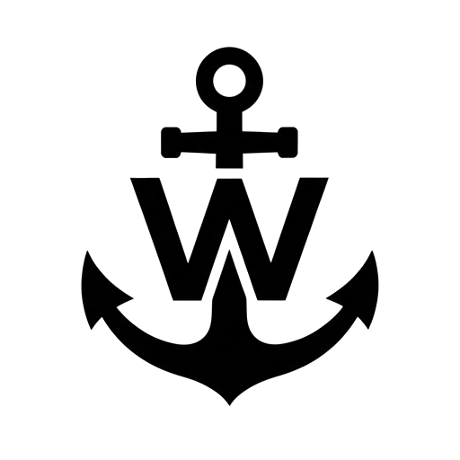

    

  # W Anchor

  **Your Anchor Watchman**

  
An open-source anchor watch app for Android

  

    
  

### About W Anchor

A reliable Flutter application designed for boaters to monitor their anchor position and provide a loud, persistent alarm if the anchor drags outside a predefined safety radius. Built with a focus on background stability and, high-priority notification delivery. 

---

## Features

* **Real-time GPS Monitoring:** Continuous, high-accuracy location tracking.
* **Background Service:** Persistent, monitoring to track the anchor while the app is closed.
* **Critical Alarm System:** Implements a custom Android Notification Channel to ensure the sound breaks through Do Not Disturb (DND) and silent modes.
* **Interactive Map:** Displays the boat's position, the anchor point, and the safety radius.
* **Modern Meterial 3:** Designed with Meterial 3 in mind. With themed icon support.

---